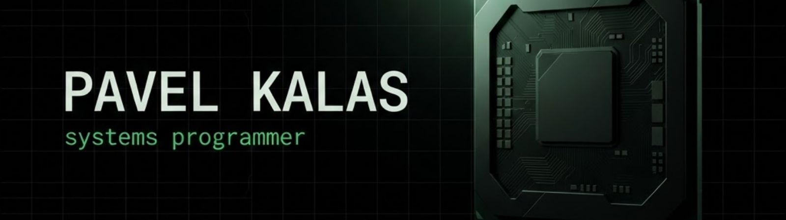

<div align="center">



<br />

<a href="https://pavelkalas.cz">
  
</a>
<a href="mailto:contact@pavelkalas.dev">
  
</a>
<a href="https://pavelkalas.cz/swipetakeflight">
  
</a>
<a href="https://youtube.com/@pavelkalas69">
  
</a>
<a href="https://instagram.com/x6pavelkalas">
  
</a>

<br /><br />


</div>

<br />

## `~` whoami

```console
pavel@aster:~$ whoami --verbose
```

Ahoj! Jsem **Pavel Kalaš**, programátor z **Poděbrad** v České republice.

Nejvíc mě baví **nízkoúrovňové programování** — chtít vědět, jak věci fungují až na úrovni hardwaru. Programuji hlavně v **C, C++, C#** a **Javě**, k tomu si přidávám **x86 assembler** tam, kde už žádná abstrakce nepomůže.

Aktuálně pracuji na projektu **[aster-core](https://github.com/pavelkalas/aster-core)** — vlastním 64bitovém kernelu pro `x86_64` s vlastním bootloaderem, shellem a souborovým systémem. Když nepíšu kód, věnuji se svému **homelabu** na Dell PowerEdge R610, kde virtualizuji pomocí VMware ESXi.

<br />

## `~` stack

<table>
<tr>
<td valign="top" width="50%">

**Jazyky**


</td>
<td valign="top" width="50%">

**Nástroje & prostředí**


</td>
</tr>
</table>

<br />

## `~` projekty

<!-- SHOWCASE-START -->
* [VcLogin](https://github.com/pavelkalas/VcLogin) - DLL-based authentication system for Vietcong 1 Dedicated Servers with account login, nickname protection, guest mode, and server-side injection.
* [LightweightDllInjector](https://github.com/pavelkalas/LightweightDllInjector) - A lightweight C# DLL injector supporting single injection and automatic injection into newly created processes.
* [aster-core](https://github.com/pavelkalas/aster-core) - Vlastní 64bit kernel pro x86_64 s bootloaderem, shellem, souborovým systémem a základními nástroji.

<!-- SHOWCASE-END -->

<br />

## `~` homelab

```yaml
server:      Dell PowerEdge R610
hypervisor:  VMware ESXi
zaměření:    virtualizace · sítě · self-hosting
lokalita:    Poděbrady, Česká republika
```

<br />

## `~` statistiky

<div align="center">


<br /><br />


<br /><br />


<br /><br />


</div>

<br />

<div align="center">

```console
pavel@aster:~$ echo "díky za návštěvu" && exit
```

<sub>www: <a href="https://pavelkalas.cz">pavelkalas.cz</a> · mail: <a href="mailto:contact@pavelkalas.dev">contact@pavelkalas.dev</a></sub>

</div>
